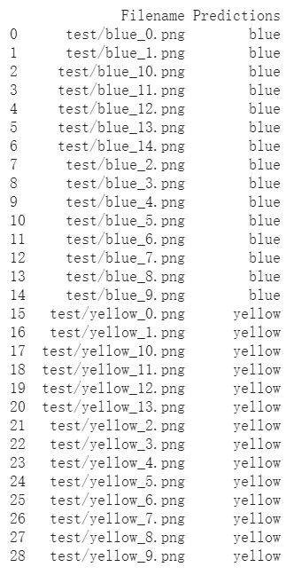

# Transfer_Learning_with_ResNet_on_Colab

 

## Training details
- This project trained a classification model by transfer learning on Google Colab
- Details of the model I trained:
     - freeze all layers except the output layer, extend the original output layer to 2 more fully connected layers
     - 310 training images, 30 validation images
     - 5 epoches
     - 99% training accuracy, 100% accuracy on test set
   
   
## Prediction result of the test set

